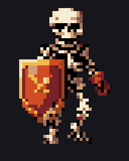
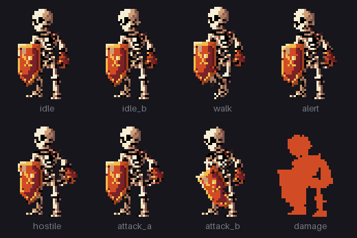
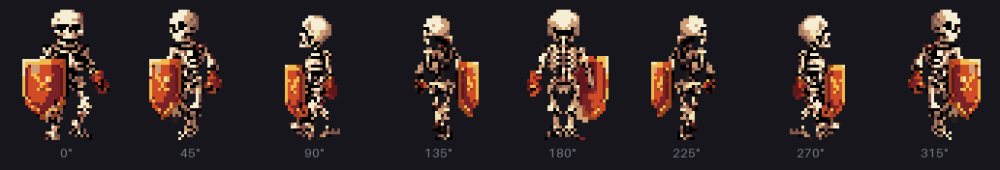
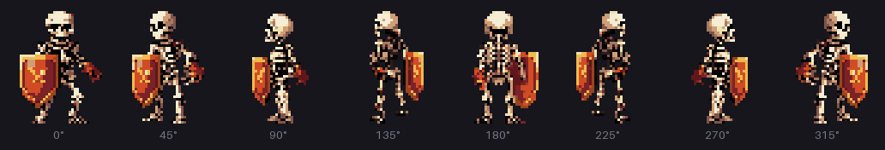
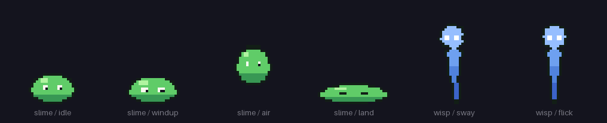
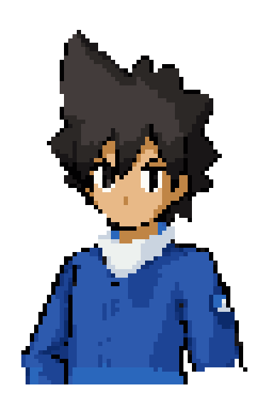
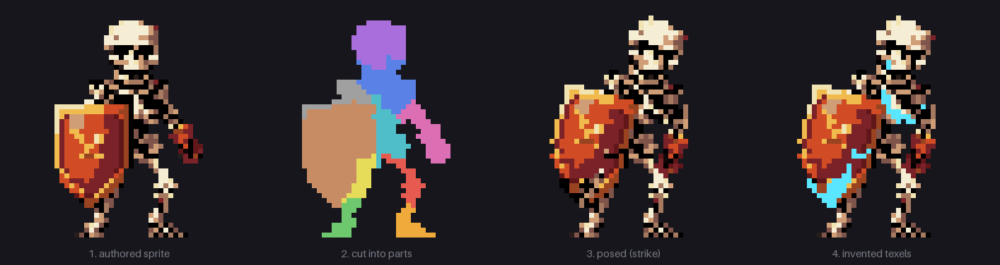

<h1 align="center">Pixel Heartness</h1>

<p align="center">
  <b>An early build of a pixel art animation suite, powered by Claude.</b><br>
  One hand-drawn sprite in, a gated, game-ready animation set out.
</p>

<p align="center">
  
</p>

> **Early build.** The core pipeline (cut, pose, gate) is solid and passes every gate on five subjects,
> including a speaking, blinking battle bust. The eight-facing turnaround is experimental: it works, and it
> has known defects, listed [below](#status). The four-character `hobos/` set is work in progress and still
> fails one gate each.

Pixel Heartness is a harness that lets a coding agent animate pixel art without ever painting a pixel.
The agent writes **poses as JSON**. Deterministic code **moves the texels the artist already drew**.
**Fifteen mechanical gates** then check the result. It was built with Claude, which drives it day to
day. Nothing in it is specific to Claude, though. Every step is a CLI command that reads and writes
JSON, PNG and plain text, and reports through exit codes. Any agent that can run a shell, edit files
and (ideally) look at an image can drive it. [AGENTS.md](AGENTS.md) is the manual for agents.

## What it makes

<p align="center">
  <br>
  <sub>Eight states for one character (idle, idle_b, walk, alert, hostile, sword attack, shield bash,
  damage), shown at the 3/4 facing. The poses were authored by an agent, and every frame is made of the
  artist's own texels.</sub>
</p>

<p align="center">
  <br>
  <br>
  <sub>The walk and the sword attack at all eight facings: 264 frames across the full set, packed into a game
  atlas with a manifest (frame ranges, timing, loop flags, the attack's commit frame).</sub>
</p>

<p align="center">
  <br>
  <sub>Other body types need other motion primitives. The slime uses volume-preserving squash and
  stretch; the wisp's tail trails its head through a lag chain.</sub>
</p>

<p align="center">
  <br>
  <sub>Faces get their own mechanism. This 83-texel trainer bust blinks and lip-syncs to a voice clip using
  the six-viseme method below. Eyes and mouth are swapped in as whole authored variants, never rotated.</sub>
</p>

## How it works

<p align="center">
  
</p>

1. **Cut.** `segment.py` splits the sprite into parts with a colour-weighted flood from a few seed
   texels per part, so the cuts follow the edges the artist drew. The agent supplies coordinates it
   has read off a numbered grid. It never guesses them.
2. **Underlap.** A part that rotates away from its neighbour exposes texels nobody drew. Each part is
   therefore extended *underneath* the parts in front of it. At rest this growth is hidden by z-order,
   and it shows exactly where a gap would otherwise open. How far each part extends is worked out from
   the rig's own poses; it is not a tuned constant. Limbs hidden behind a shield are rebuilt from their
   mirror-image twin. In panel 4 above, the cyan texels are the ones the pipeline invented, and they are
   copies of authored texels, so the palette never grows.
3. **Pose.** A state is a list of frames. Each frame gives `{rot, dx, dy, sx, sy}` per part over an FK
   hierarchy, plus optional squash, chain lag, part variants, a colour flash and a facing (`yaw`).
4. **Gate.** `checks.py` runs the gates and exits with the number that failed. The rest pose must be
   bit-identical to the source. No frame may introduce a colour or tear a hole in the body. Feet stay
   on the floor row, and consecutive keys must read as different silhouettes. Other gates catch
   floating strays, sub-texel drift and small features destroyed by rotation. The full list is in
   [docs/REFERENCE.md](docs/REFERENCE.md#gates--checkspy).
5. **Stamp faces.** Features under about 16 texels (eyes, mouth, jaw) are never rotated: nearest-neighbour
   rotation shreds them. A part with `"mode": "orthogonal_stamp"` instead swaps in authored **variants**
   (open, wide, round, blink, squint) at an integer anchor that follows its parent bone, the way Spine
   slot attachments work. Speech uses the six-viseme recipe in
   [pixelanim/methods/speech_viseme_6f.md](pixelanim/methods/speech_viseme_6f.md). The rotation gate
   reports 0% feature damage on the trainer bust.
6. **Look.** `sheet.py` renders numbered grids, contact sheets and GIFs. It also prints **text maps**
   of part labels and palette indices, because a render shows *where* a texel is but not *which colour
   family* it belongs to.

The main idea: **a generative model may supply a motion curve or reference art, but it never places
a texel in a frame.** That is why palette closure, whole-texel motion and a pixel-exact rest pose are
guaranteed by construction rather than hoped for.

## Quick start

Needs Python 3 with numpy, Pillow and SciPy (developed on 3.14).

```bash
pip install -r requirements.txt

RIG=examples/skeleton_warrior/rig_2bone.json
python pixelanim/segment.py $RIG                  # cut into parts
python pixelanim/render.py  $RIG                  # pose + composite -> strip + tag table
python pixelanim/checks.py  $RIG                  # the gates; exit status = failures
python pixelanim/sheet.py contact $RIG --mark-synth
python pixelanim/sheet.py gif     $RIG --state walk
```

Output goes to `out/` next to the rig: `<name>_strip.png` plus an Aseprite-style `<name>_strip.json`
(frame rects, durations, tags), which any sprite packer can read.

The eight-facing set shown above:

```bash
RIG=examples/skeleton_warrior/rig_fullset.json
python pixelanim/segment.py $RIG && python pixelanim/render.py $RIG && python pixelanim/checks.py $RIG
python examples/skeleton_warrior/make_game_atlas.py   # atlas + JSON manifest + a C++ include
python examples/make_media.py                         # regenerate every GIF in this README
```

To animate your own sprite, follow [docs/GETTING_STARTED.md](docs/GETTING_STARTED.md).

### Making the sprite first (optional)

`pixelanim/studio.py` bridges the [Graydient](https://graydient.ai) CLI to the rest of the pipeline. It needs
the `graydient` command on your PATH and an account, and nothing else in the repo depends on it. A sprite
goes through three stages: `krea2` draws the base art, `edit-qwen21-turbo` swaps the white background for
real alpha, and `pixelize.py` snaps it to an exact texel grid and a closed palette, locally and
deterministically.

```bash
python pixelanim/studio.py generate "a scruffy alley brawler in a ragged leather jacket"     --out out/brawler/front.png --height 48 --colours 16
python pixelanim/studio.py isolate  concept.png --subject "sidewalk tiles" --out out/tile.png  # existing art
python pixelanim/studio.py turnaround out/brawler/front.png --out-dir out/brawler/views --subject brawler
python pixelanim/studio.py scaffold biped brawler out/brawler/front.png --out out/brawler/rig.json
```

Keep the edit prompt short and free of the words "RGBA" or "transparent background": longer prompts made
the model draw a literal checkerboard into the pixels. The skill file for agents that drive this is
[skills/pixelanim/SKILL.md](skills/pixelanim/SKILL.md) (mirrored in `.agents/skills/`).

## Driving it with an agent

Hand your agent this repository and [AGENTS.md](AGENTS.md). (Claude Code picks it up automatically
through [CLAUDE.md](CLAUDE.md).) The loop is:

```
read the sprite -> render the grid -> place seeds -> segment -> check the text map
-> write states -> render -> run gates -> read the contact sheet -> revise
```

The agent needs a shell, file editing, and Python with numpy, Pillow and SciPy. Image input makes it
better, but it isn't strictly required: every structural defect found so far was caught by a gate or
a text dump, not by eye. What vision adds is **taste**. The gates can rank four candidate idles, but
only a look can tell you which one reads as breathing and not a gesture.

## Status

| | |
|---|---|
| **Solid** | Segmentation with seed validation, derived underlap, mirror rebuild, FK render, ground lock, squash/stretch, chain lag, part variants, orthogonal slot stamping for faces, six-viseme speech, colour flash, 15 gates, text/grid/contact/GIF views, retargeting a 2D keypoint clip into a state. The skeleton, hobo and trainer rigs pass 15/15 (the Aseprite `agree` gate skips without a strip). |
| **In progress** | `examples/hobos/` (Barnaby, Carl, Dan, Slick): four generated characters with blink and speech parts. 14/15 each. The `holes` gate fails on one frame per character (21 to 22 torn texels on the `ready` pose for three of them, 1 texel on Slick's idle). The cut needs seeds or underlap reworked, not new art. |
| **Experimental** | Eight facings (`yaw`). Side and back art for each part comes from generated turnaround views, corrected onto the sprite's grid and palette (`pixelize.py`). The full skeleton set is 264 frames and passes 14/15 gates. |
| **Known defects** | At some facings, thin one-texel cracks open at the shoulder seam when an arm swings (the `holes` gate fails on those frames). The rear views read as a dark mass. There is no jaw or face variant yet, so no talk state. The eight-facing code has no Aseprite (Lua) mirror, so `agree` is skipped there. See [docs/DEFECTS.md](docs/DEFECTS.md). |
| **Not yet** | Mouth and eye variants are still hand-authored or generated per character, with no automatic proposal. Seed proposal that generalises past bipeds, transitions and interruption rules between states. |

## Layout

| path | what |
|---|---|
| `pixelanim/segment.py` | cut a sprite into parts, derive underlap, rebuild hidden limbs |
| `pixelanim/render.py`, `riglib.py` | FK, primitives, ground lock, compositing, strip + tag table |
| `pixelanim/checks.py` | the gates |
| `pixelanim/sheet.py` | grid, parts, contact sheet, GIF, text maps |
| `pixelanim/rig.lua` | the same maths inside Aseprite, for hand touch-ups (optional) |
| `pixelanim/retarget.py`, `bvh.py` | fit a keypoint or mocap clip to a rig state |
| `pixelanim/rotscan.py` | list the rotation angles a small part survives cleanly |
| `pixelanim/studio.py` | Graydient bridge: generate, isolate transparency, turnaround, scaffold a rig |
| `pixelanim/methods/` | executable recipes, currently the six-viseme speech method |
| `pixelanim/pixelize.py`, `facing.py`, `mirrorpatch.py`, `walkcheck.py` | turning generated view art into on-grid, on-palette sprites |
| `examples/skeleton_warrior/` | the biped: front rig, two-bone legs, eight-facing views and the full set |
| `examples/hobo/`, `examples/trainer/` | face work: jaw and eye variants, speech, and an 83-texel 16-colour battle bust with audio |
| `examples/hobos/` | four more generated characters (in progress, see Status) |
| `examples/slime/`, `examples/wisp/` | squash/stretch and chain lag (`make_examples.py` regenerates them) |
| `examples/make_media.py` | renders every picture in this README |

## Documentation

| doc | read it for |
|---|---|
| [AGENTS.md](AGENTS.md) | the operating manual for an agent: rules, loop, commands, how to read gate output |
| [docs/GETTING_STARTED.md](docs/GETTING_STARTED.md) | animating your own sprite, step by step |
| [docs/REFERENCE.md](docs/REFERENCE.md) | how the cut, underlap, gates, primitives and ground lock work; the rig file |
| [docs/ANIMATION_SET.md](docs/ANIMATION_SET.md) | the target animation set per character, the gaps to it, and status |
| [docs/DEFECTS.md](docs/DEFECTS.md) | open defects, the backlog, and how each defect class was found |
| [docs/SPIKE_YAW.md](docs/SPIKE_YAW.md) | the eight-facing work: what was tried, with numbers |
| [docs/EXPERIMENT_CMU.md](docs/EXPERIMENT_CMU.md), [docs/EXPERIMENT_DIFFUSION.md](docs/EXPERIMENT_DIFFUSION.md) | real mocap retargeting; diffusion turnarounds plus deterministic pixel correction |
| [docs/SPIKE_FACIAL_AND_COMPOSITION.md](docs/SPIKE_FACIAL_AND_COMPOSITION.md) | why passing gates did not make a face readable, and the slot-stamping design that fixed it |
| [docs/HANDOFF.md](docs/HANDOFF.md) | the original argument and engineering history |

## Origin

Pixel Heartness started inside a UE5 dungeon-crawler project, where its strips feed a sprite packer
and a billboard material. That engine wiring stays in the game; this repo is engine-agnostic. The
Python package is still called `pixelanim`, its original working name.

## License

[MIT](LICENSE).
