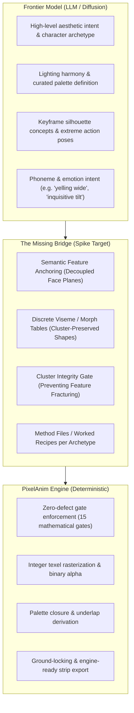

# PixelAnim Architecture Spike: Composition Efficacy, Facial Readability & Advanced Compositing
*Handoff Document for Fresh Coding Session*

---

## 1. Executive Context & The Problem Statement

In the previous proof-of-concept, we successfully integrated Graydient's `qwen21` (native RGBA) with `pixelanim`, rigged a complete 6-state Hobo brawler, generated voice dialogue with `audio-auk`, and produced an audio-synchronized 12 FPS MP4 video. All 15 mathematical gates in [`checks.py`](file:///D:/pixelanim/pixelanim/checks.py) passed with exit code 0 (zero torn texels, zero palette bleed, whole-texel translations, ground lock).

### The Fatal Flaw
Despite passing every mathematical invariant, **the character's face does not read recognizably as a human face**. Across speech and movement frames:
- The eyes, nose, and mouth lose anatomical structure and dissolve into an ambiguous cluster of colored pixels.
- The jaw animation looks like a shifting mass of beard pixels rather than natural lip-sync articulation.
- Small affine rotations (even 2°–3°) cause nearest-neighbor phase cancellation, destroying facial feature continuity.

### The Strategic Decision
Rather than manually nudging pixels on this single sprite, this failure is diagnosed as **an architectural limitation of `pixelanim`'s current composition model**. This document establishes the research spike and implementation roadmap to bridge the gargantuan gap between what is mathematically validated and what is visually readable.

---

## 2. Technical Diagnosis: Why 15 Passed Gates $\neq$ Facial Readability

```text
[Mathematical Gate Pass]                         [Visual Perception Failure]
- 0 torn texels (holes)              =/=>        - Eyeline disappears into brow
- 0 off-palette colors (palette)     =/=>        - Pupil gaze shears across cells
- Integer translations (wholetexel)  =/=>        - Mouth reads as noisy noise, not an aperture
- 0 floaters                         =/=>        - Facial planes collapse under affine shear
```

### A. The Sub-16px Scale Reality
In a standard retro sprite (e.g. 32x46 or 48x48 cell):
- The entire head is roughly **$9 \times 11$ texels**.
- An eye is **$1 \times 1$ or $2 \times 1$ texels**.
- The nose is **$2 \times 3$ texels**.
- The mouth slit is **$3 \times 1$ texels**.

At this scale, **continuous 2D affine mechanics (rotation, translation, scaling) completely collapse**. When a 1-texel black pupil rotates by 3° about a distant pivot, nearest-neighbor rounding either duplicates the texel, deletes it, or shifts it into an adjacent color cell. This destroys the **T-zone** (the spatial relationship between eyes, nose bridge, and mouth) that the human visual cortex relies on for face recognition.

### B. Cluster Theory vs. Arbitrary Texels
Professional pixel art is not drawn pixel-by-pixel; it is drawn in **clusters** (contiguous islands of identical color that define lighting volumes and anatomical planes). 
- In `pixelanim`, parts are treated as arbitrary binary masks filled with colors. 
- When `segment.py` flood-fills a `jaw` part or `render.py` rotates it, it treats the mouth slit, mustache, and chin beard as a single rigid polygonal cutout.
- In reality, a mouth opening is a **non-affine shape change**: the dark aperture appears *inside* the skin volume; the chin drops; the nasolabial folds deepen. Simulating non-affine facial expression using affine 2D cutouts inevitably produces distorted visual noise.

### C. The Two Motion Classes (Revisiting `HANDOFF.md` §2)
In the original harness handoff, a fundamental distinction was made:
1. **Left Column (Deformable via Rig)**: Limb swings, whole-body tilts, crouching bobs, squash/stretch, weapon arcs.
2. **Right Column (Needs New Information / Non-Affine)**: Head turning to profile, mouth opening/closing, eye blinking, foreshortening.

The hobo face failed because **we attempted to animate a Right-Column problem with Left-Column tooling**.

---

## 3. Division of Labor: Frontier Model vs. PixelAnim Harness

To make high-end sprite animation cheap, we must divide responsibilities according to what each system inherently does best:



| Dimension | Frontier Model (Qwen 2.1 / LLM) | PixelAnim Harness (Local Toolkit) |
|---|---|---|
| **What it Excels At** | Broad visual coherence, artistic styling, creative caricature, natural speech cadence (`audio-auk`). | Strict mathematical constraints, zero color leakage, whole-integer positioning, rock-solid stability. |
| **What it Fails At** | Precise 1-texel cluster discipline across 30+ frames without drift or flickering. | Evaluating aesthetic readability, recognizing facial anatomy, or understanding visual taste without explicit rules. |
| **The Core Goal** | Send high-level semantic instructions (e.g. *"Pose 3: Viseme 'O', Brow 'Frown', Eyes 'Gaze_L'"*). | Provide the formal mechanics and compositing rules so those instructions compile into clean texels without human touch-up. |

---

## 4. Intermediate & Advanced Compositing Techniques to Investigate

The upcoming spike should focus on four concrete architectural paradigms:

### Technique 1: Discrete Viseme & Expression Morph Targets (Non-Affine Face Layers)
- **Concept**: Instead of rotating a `jaw` part affinely, the face is treated as a **Morph Plane**.
- **Mechanism**: The mouth and eye regions do not rotate with affine matrices. Instead, they snap to a discrete table of handcrafted or model-curated **Viseme Clusters**:
  - `M_REST`: Closed neutral mouth ($3 \times 1$ line with 1-texel lower shadow).
  - `M_A`: Open vertical aperture ($3 \times 2$ dark oval with teeth highlight).
  - `M_O`: Rounded lip aperture ($2 \times 2$ circle).
  - `M_WIDE`: Yelling/shouting ($4 \times 3$ stressed cavity with tongue/teeth).
  - `E_REST`: Open eyes ($2 \times 1$ sclera + $1 \times 1$ pupil).
  - `E_BLINK`: Closed eyelid line.
  - `E_SQUINT`: High-tension diagonal wince.
- **Why this Works**: It respects cluster theory. Every viseme shape is an anatomically verified pixel arrangement that never undergoes lossy nearest-neighbor rotation.

### Technique 2: Anchor-Snapping vs. Rotational Hierarchies (Decoupled Cranium)
- **Concept**: In traditional 2D animation (e.g. Popeye, Cuphead, classic Capcom CPS2 sprites), the cranium can tilt, bob, or stretch, but **the facial cluster stays locked to an anatomical anchor point without rotational distortion**.
- **Mechanism**: The head root calculates rotation $\theta$ and displacement $(dx, dy)$ for the cranium and hat. However, the facial feature plane (`eyes`, `nose`, `mouth`) computes its position via **whole-texel snapping to an anchor coordinate**, rendering orthogonally without fractional shear.
- **Result**: The head nods and bobs naturally, but the facial features remain 100% crisp and legible.

### Technique 3: Shade-Role IR & Cluster Compilers (HANDOFF §10, Item 8)
- **Concept**: Decomposing facial sprites into semantic roles:
  1. `Outline` (dark ink)
  2. `Base Volume` (skin midtone)
  3. `Shadow Plane` (beard/brow occlusions)
  4. `Accent / Specular` (eye pupil, sclera white, nose glint, teeth)
- **Mechanism**: Instead of rotating raw RGB pixels, the compiler preserves the topology of the Accent and Outline roles. A gate verifies that an accent (such as a 1-texel eye glint) is never swallowed or blended by surrounding base volume.

### Technique 4: Multi-Scale Semantic Downsampling (Diffusion High-Res $\rightarrow$ Feature-Preserved Pixel Art)
- **Concept**: Qwen 2.1 can easily generate a gorgeous, expressive 512x512 facial expression. Current `pixelize.py` downsamples via whole-box variance minimization, which often loses tiny features like nostrils or eyelids.
- **Mechanism**: Implement a **Feature-Weighted Downscaler**:
  - In addition to color rarity (`--preserve`), introduce a **Contrast-Salience Kernel** that identifies high-frequency facial landmarks (pupil, mouth opening) and forces grid offset search to center cells over those landmarks.

---

## 5. Concrete Roadmap & Falsifiable Experiments for the Next Session

When opening the new coding session, execute the following staged validation plan:

### Phase 1: The Face Readability Benchmark (Falsification Test)
- **Test Asset**: Use the existing Hobo head ($12 \times 12$ texel region).
- **Control**: Current affine rotation approach (`head` rot + `jaw` rot).
- **Treatment**: Discrete Viseme Morph Target (Technique 1) with Anchor-Snapping (Technique 2).
- **Success Metric**: Side-by-side comparison across 12 speech frames. The face must clearly read as speaking without pixel scramble or sheared eyes.

### Phase 2: Implement the `cluster` Quality Gate in `checks.py`
- Formulate a mathematical gate that asserts **Cluster Integrity**:
  - For defined feature regions (`eyes`, `mouth`, `glints`), measure the connected-component count and aspect ratio.
  - If an eye pupil splits into two diagonal half-texels or vanishes, `checks.py cluster` fails immediately with the offending frame and coordinate.

### Phase 3: Build the First Method File (`pixelanim/methods/face_speech.md`)
- Create `pixelanim/methods/` (item #1 on the original backlog).
- Document the standard viseme cluster table, timing ratios, and anchor constraints for low-res biped faces so that any coding agent or frontier model can assemble facial animation with zero guesswork.

---

## 6. Handoff Checklist for Next Session

1. **Working Branches & Locations**:
   - Harness: [`D:\pixelanim`](file:///D:/pixelanim)
   - Hobo Reference Asset: [`D:\pixelanim\examples\hobo`](file:///D:/pixelanim/examples/hobo)
   - Audio Test Line: [`D:\UE5.8\BumFightManager\Content\Audio\Dialogue\hobo_voice_test.mp3`](file:///D:/UE5.8/BumFightManager/Content/Audio/Dialogue/hobo_voice_test.mp3)
   - Current Lipsync MP4: [`D:\UE5.8\BumFightManager\Content\Audio\Dialogue\hobo_lipsync.mp4`](file:///D:/UE5.8/BumFightManager/Content/Audio/Dialogue/hobo_lipsync.mp4)
2. **Immediate First Action**:
   - Read this document ([`D:\pixelanim\docs\SPIKE_FACIAL_AND_COMPOSITION.md`](file:///D:/pixelanim/docs/SPIKE_FACIAL_AND_COMPOSITION.md)).
   - Implement Phase 1 (Discrete Viseme Morph Target vs. Cutout Jaw Rotation) on the Hobo head.
